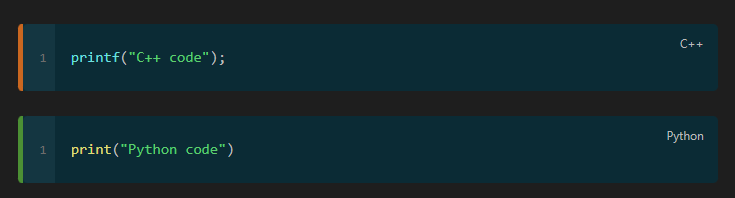
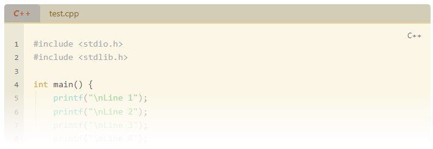
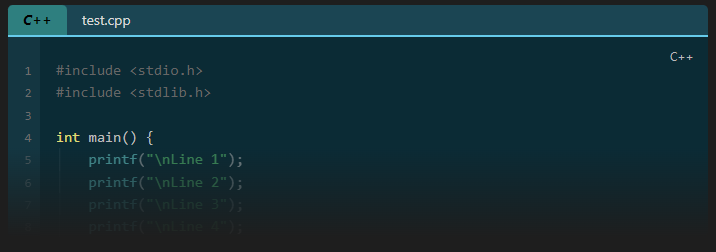
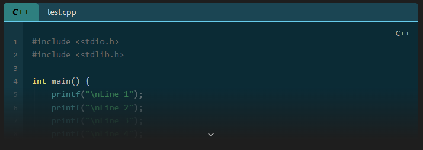
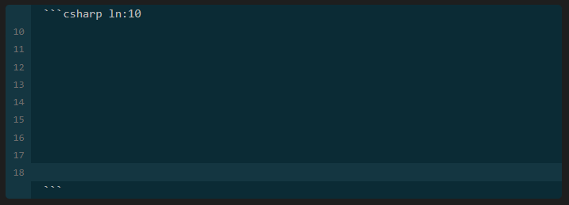
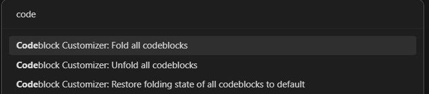
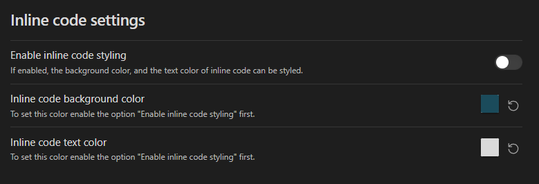
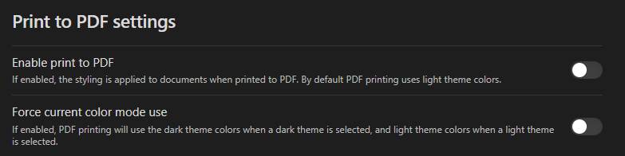
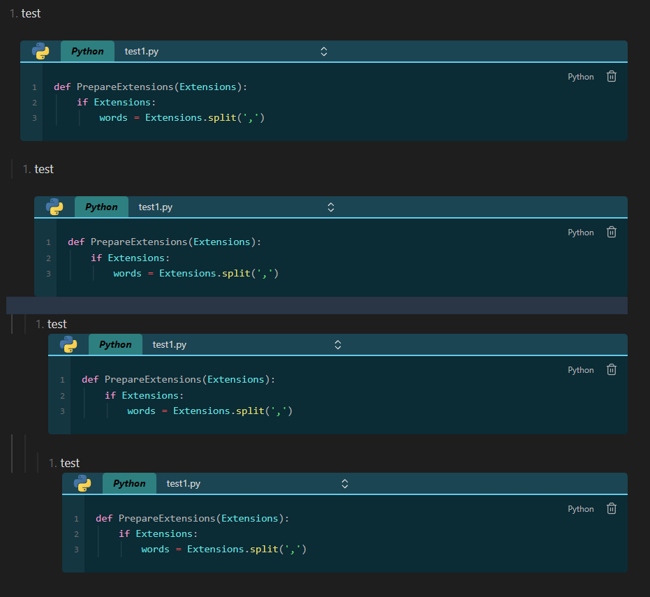

<h1 align="center">Codeblock Customizer Plugin</h1>

<p align=center>
<a href="https://github.com/mugiwara85/CodeblockCustomizer/releases/latest"></a>
<a></a>
</p>

> [!important]
> Version `1.2.7` changes
>
> New:
> - Custom SVGs
> - Option to uncollapse all codeblock on printing
> - Bracket highlight (click next to a bracket to highlight it and its opening/closing pair)
> - Selection matching (select text to highlight the where the text is found in the document)
> - Inverse fold behavior
> - Option to unwrap code in reading view  
> - Text highlight with from and to markers
>   
> Modified:
> - Semi-fold does not count start and end lines (line with opening and closing backticks) in editing mode anymore
> - Hide inactive options on settings page
> - Performance improvements
> - CSS copy and delete code positioning fix
> - Moved border colors to language specific colors
> - Language specific colors can now be set for code blocks without a language as well (specify `nolang` as a language)
> - Fixed a few smaller bugs


This is a plugin for Obsidian (https://obsidian.md).

The plugin lets you customize the code blocks in the following way:
- Default Obsidian and Solarized theme. You can create your own themes as well.
- Enable editor active line highlight. The active line in Obsidian (including code blocks) will be highlighted (you can customize the color).
- Enable code block active line highlight. The active line inside a code block will be highlighted (you can customize the color).
- Exclude languages. You can define languages separated by a comma, to which the plugin will not apply. You can also define `exclude` for specific code blocks to exclude them.
- Set background color for code blocks.
- Lets you highlight specific lines.
    - Customize highlight color
- Lets you define multiple highlight colors to highlight lines.
- Display filename
    - If a filename is defined a header will be inserted, where it is possible to customize the text (color, bold, italic), and the header (color, header line) itself as well
- Fold code
    - If the header is displayed (either by defining filename or other way explained below), you can click on the header to fold the code block below it 
- Display code block language. This displays the language (if specified) of the code block in the header. 
    - Customize text color, background color, bold text, italic text for the language tag inside the header.
    - By default the language tag is only displayed, if the header is displayed, and a if a language is defined for a code block. You can however force, to always display the code block language, even if the header would not be displayed.
- Display code block language icon (if available for the specified language) in the header.
- Add line numbers to code blocks
    - Customize if the line number should also be highlighted, if a line is highlighted
    - Customize background color, and color of the line numbers
- and much more...

## Parameters

Parameters can be defined in the opening line of a code block (after the three opening backticks). 
All parameters can be defined using `:` or `=`.
Available parameters:

| Name    | Value           | Description                                                                                                                                                                                                                                                             |
| ------- | --------------- | ----------------------------------------------------------------------------------------------------------------------------------------------------------------------------------------------------------------------------------------------------------------------- |
| fold    |                 | Defines that the code block is in folded state when the document is opened.                                                                                                                                                                                             |
| unfold  |                 | Defined that the code block is in unfolded state when the document is opened and the `Inverse fold behavior` option is enabled, otherwise ignored.                                                                                                                      |
| exclude |                 | Exclude the code block from the plugin.                                                                                                                                                                                                                                 |
| hl      | Multiple        | **Everything that applies to the `hl` parameter also applies to alternative highlight colors!**<br>Multiple values can be combined with a `,` (e.g: `hl:test,3,5-6,9\|abc,test1,test2,10-15\|test3`)<br>Highlights specified lines or words based on different formats: |
|         | hl:5            | Highlights line 5.                                                                                                                                                                                                                                                      |
|         | hl:5-7          | Highlights lines from 5 to 7.                                                                                                                                                                                                                                           |
|         | hl:test         | Highlights all lines containing the word "test", or the word itself, if the option `Highlight words instead of lines` is enabled. (hl:test,abc)                                                                                                                         |
|         | hl:5\|test      | Highlights line 5 if it contains the word "test", or the word itself in line 5 if, if the option `Highlight words instead of lines` is enabled.                                                                                                                         |
|         | hl:5-7\|test    | Highlights lines 5 to 7 if they contain the word "test", or the word itself in lines 5 to 7 if, if the option `Highlight words instead of lines` is enabled.                                                                                                            |
|         | hl:abc:xyz      | Highlights lines containing text starting with "abc" and ending with "xyz", or the text itself if, if the option `Highlight words instead of lines` is enabled.                                                                                                         |
|         | hl:5\|abc:xyz   | Highlights line 5 if it contains text starting with "abc" and ending with "xyz", or the text itself in line 5 if, if the option `Highlight words instead of lines` is enabled.                                                                                          |
|         | hl:5-7\|abc:xyz | Highlights lines 5 to 7 if they contain text starting with "abc" and ending with "xyz", or the text itself in lines 5 to 7 if, if the option `Highlight words instead of lines` is enabled.                                                                             |
| file    | {string}        | Sets the display text for the header. (e.g: file:hello or file:"Hello World!")                                                                                                                                                                                          |
| title   | {string}        | Alias for `file`                                                                                                                                                                                                                                                        |
| ln      | Multiple        |                                                                                                                                                                                                                                                                         |
|         | true            | Displays line numbers for that specific code block, even if `Enable line numbers` is disabled                                                                                                                                                                           |
|         | false           | Does not display line numbers for that specific code block, even if  `Enable line numbers` is enabled                                                                                                                                                                   |
|         | {number}        | Sets the offset for line number to start (e.g: ln:5 -> line numbering strts from 5)                                                                                                                                                                                     |

## Themes

The plugin comes with a default Obsidian and a Solarized theme. The default theme is Obsidian.

Default Solarized theme (dark mode): 


Default Solarized theme (light mode): 


How the themes work:
- Every setting and color is saved in the theme, except the excluded languages.
- You can't modify or delete the default themes.
- When you switch themes, all unsaved changes are lost. Therefore it is recommended to create your own theme (unless you are happy with the default settings and will never change the theme), and always save your changes. If you made a change, and did not save it, the theme will not include it! 
- Each theme has its own light and dark colors. To customize the light/dark colors, just switch Obsidian to light/dark mode, and you can change the colors for that mode.
- When creating a new theme the currently selected theme will be taken as a template for the new theme.
- After saving changes in a theme, these become the new default values. Example: You select a color (red) and save the theme. Now, this color is the default value. This means, that if you click the "restore default color" icon next to the color picker the color red will be restored.

## Highlighting

### Main highlight

To highlight lines specify `hl:` followed by line numbers in the first line of the code block. 
- You can specify either single line numbers separated with a comma e.g.: `hl:1,3,5,7`.
- You can specify ranges e.g.: `hl:2-5` This would highlight lines from 2 to 5. 
- You can also combine the methods e.g.: `hl:1,3,4-6` This would highlight lines 1, 3 and lines from 4 to 6.

Example:  
` ```cpp hl:1,3,4-6`


### Alternative highlight

You can define multiple highlight colors. This means, that you have to define a name for the highlight color. This name will be used as a parameter, and you can use it just like with the `hl` parameter. 

Example: 
You define three types of highlight colors (`info`, `warn`, `error`). After that set the colors. After that you can use it in the first line of code blocks:
` ```cpp info:2 warn:4-6 error:8`


Example code block with multiple highlight colors:

![[Pasted_image_20230314211417.png]](attachments/Pasted_image_20230314211417.png)

### Text highlight

It is possible now to highlight text instead of lines. To use this option you have to enable the `Highlight words instead of lines` option in the settingstab on the "Codeblock" settings page. You can still use the normal highlight as before, but the option got extended:
* If after the `hl:` parameter a string is defined, then the string is highlighted in every line it is present in the code block. Example: `hl:extension`
* If after the `hl:` parameter a number is defined, followed by a pipe "|", followed by a string, then the word is highlighted only in this line if it is present. Example: `hl:9|print`
* If after the `hl:` parameter a range is defined, followed by a pipe "|" character, followed by a string, then the word is highlighted only in these line ranges, if it present. Example: `hl:6-7|print`
* If after the `hl:` parameter a string, followed by a `:`, followed by a string is defined, then the string will be highlighted which starts with the string before the `:`, and ends with the string after `:`. Example: 
    * `hl:abc:xyz` -> highlights text starting with `abc` and ending with `xyz`
    * `hl:5|abc:xyz` -> highlights text starting with `abc` and ending with `xyz` only on line 5
    * `hl:5-7|abc:xyz` -> highlights text starting with `abc` and ending with `xyz` only in lines from 5 to 7

> [!note]
> - You can use the text highlighting with alternative highlight colors as well!
> - If the setting `Highlight words instead of lines` is disabled, then lines will be highlighted not words. Please note, that if you used multiple colors in one line, and the option `Highlight words instead of lines` is disabled, it may result in an unexpected line highlight, since obviously only one color can be used to highlight a line.

An example code block with text highlight, using three different colors is shown below:  

![[Pasted_image_20240227234145.png]](attachments/Pasted_image_20240227234145.png)

An example code block with text highlight, using from and to markers:
![[Pasted_image_20240613130412.png]]
## Language specific coloring

In the settings, on the `Language specific colors` settings page it is now possible to define colors for languages. These colors will only apply to code blocks with the defined language. If you defined colors for "Python", then those colors will only apply to every Python code block. **If you want to specify colors for code blocks which do not have a language defined, specify `nolang` as a language.**
First, you have to add a language. Then you can select which color you want to set. Available options are:
- Code block active line color
- Code block background color
- Code block border color
- Code block text color
- Matching bracket color
- Non-matching bracket color
- Matching bracket background color
- Non-matching bracket background color
- Selection match highlight color
- Header background color
- Header text color
- Header line color
- Header language text color
- Header language background color
- Gutter text color
- Gutter background color
- Gutter active line number color
    
An example is shown below, where the background color has been defined for "Python", "JavaScript" and "C++" languages.

![[Pasted_image_20240228002357.png]](attachments/Pasted_image_20240228002357.png)

Example code blocks with border colors set:

**Don't forget to set `Codeblock border styling position`, otherwise border colors will not be displayed!**

## Display filename/title

To display a filename specify `file:` or `title:` followed by a filename in the first line of the code block. If the filename contains space, specify it between `""` e.g.: `file:"long filename.cpp"`. `title` is basically an alias for file. If both are defined, then `file` will be used

Example:  
` ```cpp file:test.cpp`  
` ```cpp title:test.py`  
` ```cpp file:"long filename.cpp"`  


## Folding

If the header is displayed, simply clicking on it, will fold the code block below it.
### Default fold

To specify an initial fold state when the document is opened, specify `fold` in the first line of the code block. If `fold` is defined in a code block, then when you open the document, the code block will be automatically collapsed, and only the header will be displayed. You can unfold the code block by clicking on the header.

Example:  
` ```cpp fold`


### Semi-fold

You can enable semi-folding in settings tab: 


After enabling it, you have to select the count of the visible lines (default is 5). Optionally you can also enable an additional uncollapse button, which will be displayed in the last line.
Semi-fold works just like the normal fold with the following differences:
- If your code block doesn't have minimum required lines, then it will fold as until now.
- If your code block does have the minimum required line (count of visible lines + 4 for fading effect), then it will semi-fold.

The number of the "fade" lines is constant, and cannot be changed. 
Example: You set the count of visible lines to 5, and you have a code block with 10 lines. In this case semi-fold will be used. The first 5 lines remain visible, and the next 4 lines will "fade away". 

>[!note]
>In editing mode the opening and closing lines (with the three backticks) do not count!

Example semi-folded code block (light theme):  


Example semi-folded code block (dark theme):  


Example semi-folded code block with additional uncollapse button:  



### Inverse fold behavior

When this options is enabled in the settings page, code blocks are collapsed by default when a document is opened, even if `fold` was **NOT** defined. If you enabled this option, and want some code blocks unfolded by default, you can use the `unfold` parameter.

## Icon

There are currently around 170 icons available for different languages. You can enable the option in the settings page to display icons in the header. If you enable this option, and if the language specified in the code block has an icon, and the header is displayed, then the icon will be displayed. You can also force to always display the icon (which also means that the header will be also displayed) even if the header is not displayed, because the `file` parameter is not defined.

## Header

The header is displayed in the following cases:
- You specified a `file:` or `title:`
- You specified `fold`. If you specified `fold` but did not specify `file:` or `title:` a default text `Collapsed code` will be displayed on the header
- You enabled the `Always display codeblock language` or the `Always display codeblock language icon` option in settings, but did not specify `file:` or `title:` or `fold`

If the header is displayed, folding works as well. If `Always display codeblock language` is enabled then the header will display the code block language as well.

Example:
- Header with fold only


- Header with code block language only


- Header with code block language and filename/title as well


- Header with code block language, filename/title and icon as well

![[Pasted_image_20230314212111.png]](attachments/Pasted_image_20230314212111.png)

## Line numbers

To enable line numbers go to the plugin settings and enable the `Enable line numbers` option. After that the line numbers will be displayed before code blocks. 

Example:

![[Pasted_image_20230314211657.png]](attachments/Pasted_image_20230314211657.png)

Example for reading mode:


### ln parameter

The `ln:` parameter can have 3 values: `true`, `false`, `number`
- If `ln` is set to `ln:true`, then for that specific code block only, the line numbers will be displayed, even if line numbers are not enabled in the settings.
- If `ln` is set to `ln:false`, then for that specific code block only, the line numbers will NOT be displayed, even if line number are enabled in the settings.
- If `ln` is set to a number, e.g. `ln:5`, then it sets the offset for the line numbers.



## Commands

There are three commands available in the command palette. You can:
- fold all code blocks in the current document,
- unfold all code blocks in the current document,
- restore original state of code blocks

If you collapsed/uncollapsed all code blocks there is no need to restore them to their original state. When you switch documents they are automatically restored to their original state.



## Inline code

If you want to style inline code, you have to enable it first. After that you can set the background color and the text color for inline code.



## Print to PDF

By default, if you print a document the styling is not applied to it. You can enable it in the settings. By default, the light colors are used for printing, but if you want to force the dark colors, you can enable the second toggle.



## Indented code blocks

Code blocks in **lists**, are now indented properly as shown below. Simply, mark the text in the code block, and press TAB. This will shift the code block right, by adding margin to the left side. Pressing TAB multiple times, indents the code block more. If you want to undo it, just select the text again, and press SHIFT+TAB.



## Links

If you want to convert markdown, wiki and normal http/https link syntax to actual links inside code blocks, then you have to mark them as comment according to the current code block language, and enable the setting `Enable links usage` in the settings on the "Codeblock" settings page. **Links can also be used in the header.**
For example if you are in a python code block, then you have write a "#" before the link (comment it out), and it will be automatically converted to a link. 
**From version `1.2.6` only commented out links will be converted!**
By default the links, which point to another document in your vault, are not updated, if you rename the file. This is because Obsidian does not provide (yet) a way to add these links to the metadata cache. A temporary solution for that is to enable the option `Enable automatically updating links on file rename` option in settings.

>[!important]
>Please note, that this method iterates over all of your documents in you vault! If you have a huge vault, it could take some time. 
>During my testing, it was however, very efficient, but please test it yourself!

Sample code block with links, but with the option `Enable links usage` disabled:

![[Pasted_image_20240228005151.png]](attachments/Pasted_image_20240228005151.png)

Same code block with the `Enable links usage` option enabled:

![[Pasted_image_20240228005240.png]](attachments/Pasted_image_20240228005240.png)

## Custom SVGs

It is possible to use custom SVGs, and apply custom syntax highlighting for code blocks. To use this feature create the following folder `<VaultFolder>\.obsidian\plugins\codeblock-customizer\customSVG`. In this folder create a file called `svg.json` with similar content:

```json
{
  "languages": [
    {
      "codeblockLanguages": ["language1", "language2"],
      "displayName": "iRule",
      "svgFile": "f5.svg",
      "format": "tcl"
    }
  ]
}
```

Explanation:
- codeblockLanguages (**required**): one or more languages, where you want to apply the displayName, SVG, and format.
- displayName (**required**): the display Language, which is displayed in the header.
- svgFile (**optional**): name of an SVGfile in the same folder. **The file must be a plain text SVG without the SVG tag itself**. Look at Const.ts for examples.
- format (**optional**): the syntax highlighting to apply for this code block.

>[!important]
>Obsidian uses two different methods for syntax highlighting. For editing mode it uses CodeMirror 6, and for reading mode it uses Prism.js. Because of this there is a slight difference between how this works. 
>- If you want to apply syntax highlighting in editing mode, then the codeblockLanguage **must NOT** have syntax highlighting, because it is not possible (or I didn't found a way) to overwrite any existing syntax highlighting. For example `language1` does not have syntax highlighting, therefore the `tcl` syntax highlighting will be applied successfully. The languages specified in `codeblockLanguages` are **case sensitive** in editing mode
>- In reading mode however it is possible to overwrite existing syntax highlighting. So you can apply C++ syntax highlighting for a python code block. The languages specified in `codeblockLanguages` are **NOT case sensitive** in reading mode.

An example using the above shown JSON file, where `tcl` syntax highlighting is applied to `language1` code blocks, using the custom SVG file, and the custom display name:

![[Pasted_image_20240613160326.png]]

## Bracket highlight

You can enable bracket highlighting for matching and also for non-matching brackets. If you click next to a bracket (`(,),{,},[,]`), then the bracket itself, and the corresponding opening/closing bracket will be highlighted. You can set individual background, and highlight colors for matching and non-matching brackets:

![[Pasted_image_20240613130848.png]]

Below is a simple example. Notice that that the matching and non-matching bracket are highlighted with different colors:

![[BracketHighlight.gif]]

## Selection matching

If you enable selection matching, you can set the background color for the matches to be highlighted with. Simply select a string, or double click on a word, and the same text will be highlighted if found:

![[selectionmatching.gif]]

>[!note]
>Selection matching (currently) has a limit of 750 matches. If there are more matches than this, then selection matching will not highlight anything. Should you encounter a case where this number is not enough, contact me, and I'll increase it.

## How to install the plugin

- Simply install directly from Obsidian
- or you can just copy over `main.js`, `styles.css`, `manifest.json` to your vault `VaultFolder/.obsidian/plugins/codeblock-customizer/`.

## Support

If you like this plugin, and would like to help support continued development, use the button below!
 
<a href="https://www.buymeacoffee.com/ThePirateKing"></a>
