<h1 align="center">Codeblock Customizer Plugin</h1>

<p align=center>
<a href="https://github.com/mugiwara85/CodeblockCustomizer/releases/latest"></a>
<a></a>
</p>

This is a plugin for Obsidian (https://obsidian.md).

The plugin lets you customize the code blocks in the following way:
- Choose from built-in themes (Obsidian, Solarized, Dracula, Gruvbox, Nord, Tokyo Night) or create your own. 
- Enable active line highlighting for the editor and for code blocks specifically. 
- Exclude specific languages or individual code blocks from styling. 
- Set custom background colors for code blocks. 
- Highlight specific lines or text segments with multiple, definable colors. 
- Display a header with a filename or title, with full styling options. 
- Fold code blocks by clicking the header, with options for default fold states and persistence. 
- Display language names and icons in the header. 
- Add line numbers with optional starting offsets. 
- Create semi-interactive terminal prompts with `prompt:`. 
- Group consecutive code blocks into a single tabbed interface. 
- Transform code comments into styled annotations. 
- Apply syntax highlighting to inline code. 
- Hide fence lines in editor mode for a cleaner look. 
- **NEW:** Added option to use PrismJS for syntax highlighting in editor mode => Same syntax highlight in editor and reading mode and more languages get syntax highlighted  
- **NEW:** Search option in the settings page to find faster a specific setting 
- **NEW:** Wrap/Unwrap button in editor mode 
- **NEW:** Execute Code Plugin compatibility 
- **NEW:** Modifier keys for buttons and inline code 
- **NEW:** New Themes (Dracula, Gruvbox, Nord, Tokyo Night) 
- **NEW:** New `parse` parameter to parse raw CLI output for promtps 
- **NEW:** New `hide` parameter to hide lines or ranges 
- **NEW:** New option to define "line number jumps" 
- **NEW:** New "Copy as image" button to create snapshots of code blocks 
- **NEW:** New blur effect for semi-fold
- **NEW:** Syntax Themes. Using this you can define each color for syntax highlighting tokens. Read more below.
- **NEW:** Added customizable frontmatter syntax coloring in editing mode
- **NEW:** Added option to define PrismJS syntax highlighting rules for custom languages
- and much more...

For a more detailed list of changes, check the [Changelog](./Changelog.txt). 

## 📋 Table of Contents 

- [Parameters](#parameters) 
- [PrismJS Syntax Highlighting](#prismjs-syntax-highlighting)
- [Themes](#themes) 
- [Display Filename/Title](#display-filenametitle) 
- [Header](#header) 
- [Line Numbers](#line-numbers) 
- [Syntax Themes](#syntax-themes) 
- [Highlighting](#highlighting) 
- [Language Specific Coloring](#language-specific-coloring) 
- [Folding](#folding) 
- [Wrap Code Lines](#wrap-code-lines)
- [Grouped Code Blocks](#grouped-code-blocks) 
- [Terminal Prompts](#terminal-prompts) 
- [Annotations](#annotations) 
- [Hide Fence Lines](#hide-fence-lines) 
- [Hiding Lines](#hiding-lines)
- [Inline Code](#inline-code) 
- [Commands](#commands) 
- [Print to PDF](#print-to-pdf) 
- [Indented Code Blocks](#indented-code-blocks) 
- [Links](#links) 
- [Custom SVGs and Syntax Highlight Assignment](#custom-svgs-and-syntax-highlight-assignment) 
- [Syntax Highlighting for Custom Languages](#syntax-highlighting-for-custom-languages)
- [Bracket Highlight](#bracket-highlight) 
- [Selection Matching](#selection-matching) 
- [Plugin Compatibility](#plugin-compatibility)
- [How to Install the Plugin](#how-to-install-the-plugin) 
- [Contributing & Support](#contributing-support) 

---

## Parameters

Parameters can be defined in the opening line of a code block (after the three opening backticks).   
All parameters can be defined using `:` or `=`.  

<details><summary><strong>Click to expand the full list of parameters</strong></summary>

| Name     | Value                 | Description                                                                                                                                                                                                                                                  |
| -------- | --------------------- | ------------------------------------------------------------------------------------------------------------------------------------------------------------------------------------------------------------------------------------------------------------ |
| fold     |                       | Defines that the code block is in folded state when the document is opened.                                                                                                                                                                                  |
| unfold   |                       | Defined that the code block is in unfolded state when the document is opened and the `Inverse fold behavior` option is enabled, otherwise ignored.                                                                                                           |
| exclude  |                       | Exclude the code block from the plugin.                                                                                                                                                                                                                      |
| hl       | Multiple              | **Everything that applies to the `hl` parameter also applies to alternative highlight colors!**<br>Multiple values can be combined with a `,` (e.g: `hl:test,3,5-6,9\|abc,test1,test2,10-15\|test3`)<br>Highlights specified **lines** on different formats: |
|          | hl:{number}           | `hl:5` - Highlights line 5.                                                                                                                                                                                                                                  |
|          | hl:{range}            | `hl:5-7` - Highlights lines from 5 to 7.                                                                                                                                                                                                                     |
|          | hl:{string}           | `hl:test` - Highlights all lines containing the word `test`.                                                                                                                                                                                                 |
|          | hl:{number}\|{string} | `hl:5\|test` - Highlights line 5 if it contains the word `test`.                                                                                                                                                                                             |
|          | hl:{range}\|{string}  | `hl:5-7\|test` - Highlights lines 5 to 7 if they contain the word `test`.                                                                                                                                                                                    |
| hlt      | Multiple              | **Everything that applies to the `hlt` parameter also applies to alternative highlight colors!**<br>Multiple values can be combined with a `,` just like for the `hl` parameter.<br>Highlights specified **text** on different formats:                      |
|          | hlt:{string}          | `hlt:test` - Highlights the word `test` in every line it is found.                                                                                                                                                                                           |
|          | hlt:{number}          | `hlt:5` - Highlights all the text in line 5.                                                                                                                                                                                                                 |
|          | hlt::{string}         | `hlt::xyz` - If the start position is not defined but the end position is, the text will be highlighted from the beginning of the line up to the end position.                                                                                               |
|          | hlt:{string}:         | `hlt:abc:` - If the start position is defined, but the end position is not, the text will be highlighted from the start position, until the end of the line.                                                                                                 |
|          | hlt:{string}:{string} | `hlt:abc:xyz` - Highlights text in lines starting with `abc` and ending with `xyz`.                                                                                                                                                                          |
|          | hlt:{number}\|...     | All the above options can be prepended with an optional number and a `\|` to specify in which line to highlight the text.                                                                                                                                    |
|          | hlt:{number}[occurence]\|... | All the above options can be prepended with an optional occurence before the `\|` to specify which occurence to highlight in the text. (e.g. `hlt:5[2,5-8]\|test` -> highlights the second, and the 5th, 6th, 7th and 8th occurence of test in line five)  |
|          | hlt:{range}\|...      | All the above options can be prepended with an optional range and a `\|` to specify in which range to highlight the text.                                                                                                                                    |
|          | hlt:{range}[occurence]\|... | All the above options can be prepended with an optional occurence before the `\|` to specify which occurence to highlight in the text. (e.g. `hlt:5-7[2,5-8]\|test` -> highlights the second, and the 5th, 6th, 7th and 8th occurence of test in the lines 5, 6, 7)  |
| lsep     | char                  | Line separator. Optionally you can define a line separator (a single character) for text highlight instead of the default `\|`. Useful, if you want to highlight text starting and/or ending with `\|`. This can be set globally as well.                    |
| tsep     | char                  | Text separator. Optionally you can define a text separator (a single character) for text highlight instead of the default `:`. Useful, if you want to highlight text starting and/or ending with `:`. This can be set globally as well.                      |
| file     | {string}              | Sets the display text for the header. (e.g: `file:hello` or `file:"Hello World!"`)                                                                                                                                                                           |
| title    | {string}              | Alias for `file`                                                                                                                                                                                                                                             |
| ln       | Multiple              |                                                                                                                                                                                                                                                              |
|          | true                  | Displays line numbers for that specific code block, even if `Enable line numbers` is disabled                                                                                                                                                                |
|          | false                 | Does not display line numbers for that specific code block, even if  `Enable line numbers` is enabled                                                                                                                                                        |
|          | {number}              | Sets the offset for line number to start (e.g: `ln:5` -> line numbering starts from 5)                                                                                                                                                                       |
|          | {number}:{number}     | Specifies a line number jump. The first number defined at which line number should the jump occur, and the second number defined the new value. (e.g.: `ln:10:20` -> line number changes on 10 to 20)                                                        |
| parse    | parse:{promptName}    | Specifies what prompts to look for when parsing the code block text. Usefull when raw CLI output was pasted in the code block and the prompts should get colors. (e.g. `parse:bash`)                                                                         |
| hide     | hide:{line or range}  | Specifies which lines or ranges should be hidden. If defined, a separator will be inserted where you can unhide the hidden ranges.                                                                                                                           |
| prompt   | {prompt}              | Sets the name of the prompt to be used in the code block e.g. `prompt:kali`. Line numbers and ranges can also be specified in which lines the prompt should be displayed e.g. `prompt:1-2,4\|bash`                                                           |
| noprompt |                       | Disables prompts for a specific code block, which is useful when the auto-use prompt option is enabled. It is also possible to specify lines or ranges for which the prompt should not be shown e.g. `noprompt` or `noprompt:1-3,5`                          |
| user     | {string}              | Overrides the default user for the current prompt.                                                                                                                                                                                                           |
| host     | {string}              | Overrides the default host for the current prompt.                                                                                                                                                                                                           |
| path     | {string}              | Overrides the default path for the current prompt.                                                                                                                                                                                                           |
| db       | {string}              | Overrides the default database for the current prompt (postgres).                                                                                                                                                                                            |
| branch   | {string}              | Overrides the default git branch for the current prompt (zshgit).                                                                                                                                                                                            |
| module   | {string}              | Overrides the default module for the current prompt (metasploit).                                                                                                                                                                                            |
| group    | {string}              | Assigns the code block to a group. Consecutive blocks with the same group name will be rendered as a single tabbed component.                                                                                                                                |
| tab      | {string}              | Sets a custom display name for the tab when using grouped code blocks. If not provided, the language name is used.                                                                                                                                           |

</details>

## PrismJS Syntax Highlighting

This is an **experimental** setting, but it is worth talking about this. 

Small background information:
The syntax highlighting wasn't the same in editing and reading mode, because Obsidian uses two different engines. The one used in editor mode is `CodeMirror 6`, and the other for reading mode is `PrismJS`. The problem with this is, that `CodeMirror` supports less languages then `PrismJS`, and even if it supports the same language it will probably still differ, because it works different.

So what does this setting do? It forces the editor to use `PrismJS` in editor mode. This results, that when this setting is enabled, the syntax highlighting is the **same** in editing and reading modes!
But that's not all! This setting also has a positive side effect. `CodeMirror` does support a lot of languages, but nearly not as many as `PrismJS`. When this setting is enabled, that also means that languages which `CodeMirror` does not support (e.g. `graphql` or `makefile` or `hlsl`) also get syntax highlighting, because `PrismJS` does support it.  

Even though this setting is not as thoroughly tested as others, I wanted to release it earlier. Should you encounter some errors or bugs, just open an issue.  

Example code block in editor mode with the setting disabled:

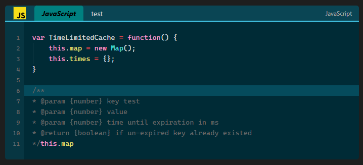

Same code block with setting enabled (matches reading mode):

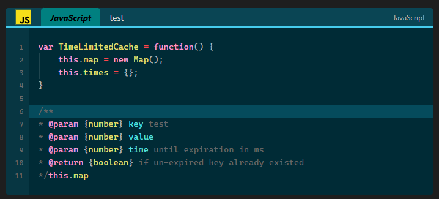


## Themes

The plugin comes with multiple themes (Obsidian, Solarized, Dracula, Gruvbox, Nord, Tokyo Night). The default theme is Obsidian.

Obsidian Theme  

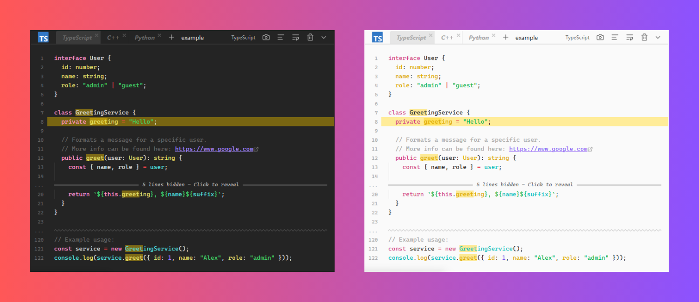

Solarized Theme  

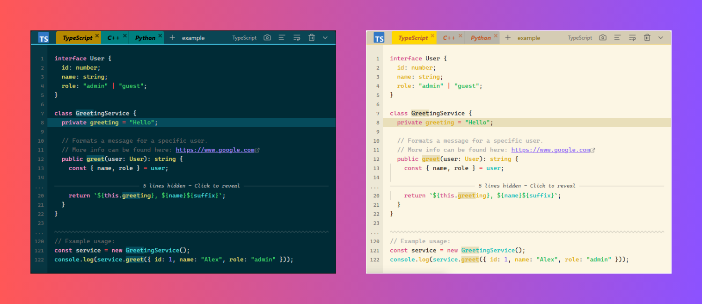

Dracula Theme  

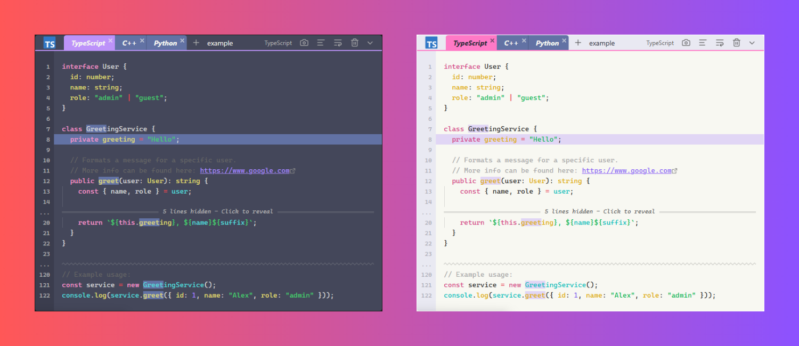

Gruvbox Theme  

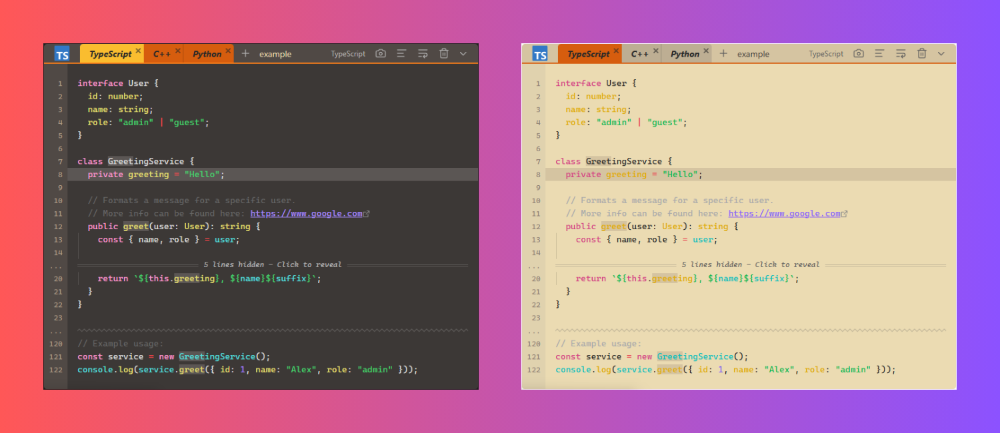

Nord Theme  

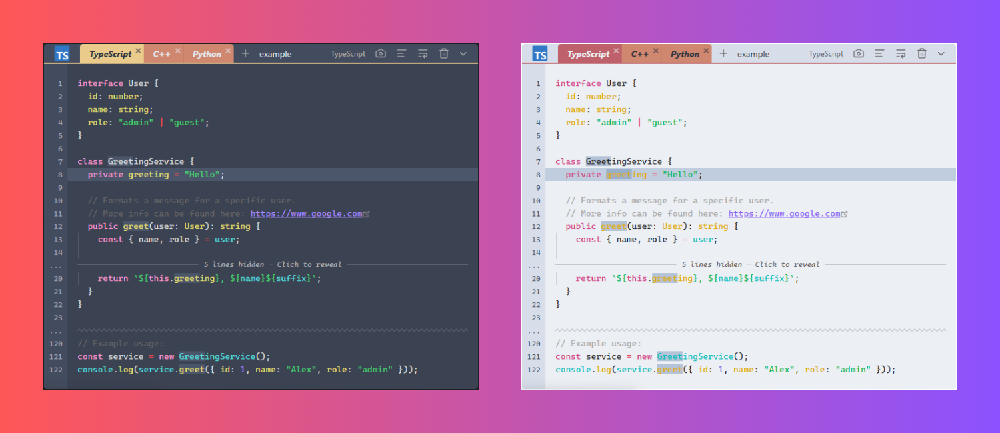

Tokyo Night Theme  

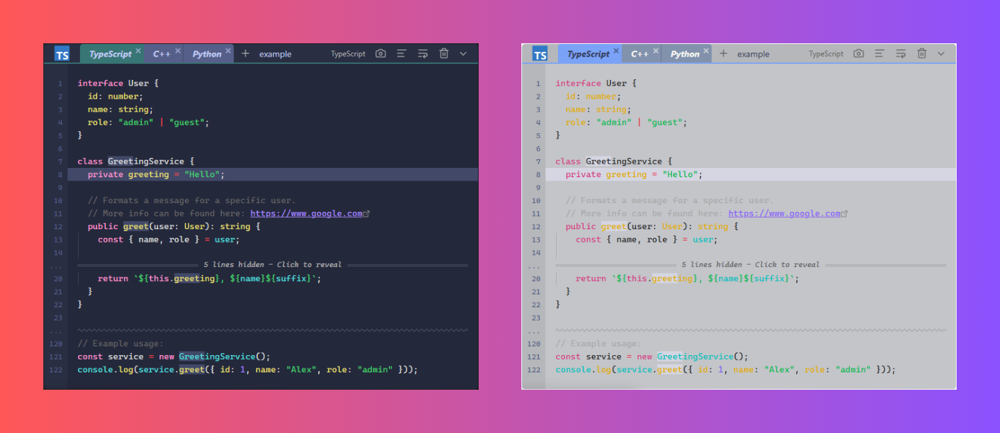

How the themes work:
- Every color is saved in the theme.
- You can modify the default themes (there is an option to restore them to default), but you can't delete them.
- Save your changes!
- Each theme has its own light and dark colors. To customize the light/dark colors, just switch Obsidian to light/dark mode, and you can change the colors for that mode.
- When creating a new theme the currently selected theme will be taken as a template for the new theme.
- After saving changes in a theme, these become the new default values. Example: You select a color (red) and save the theme. Now, this color is the default value. This means, that if you click the "restore default color" icon next to the color picker the color red will be restored.

## Display Filename/Title

To display a filename specify `file:` or `title:` followed by a filename in the first line of the code block. If the filename contains space, specify it between `""` e.g.: `file:"long filename.cpp"`. `title` is basically an alias for file. If both are defined, then `file` will be used

Example:  
` ```cpp file:test.cpp`  
` ```cpp title:test.py`  
` ```cpp file:"long filename.cpp"`  


If you want to display text which contains a `"` or `'` you'll have to escape it with a backslash. For example: `file:"Hello \" World!"`

## Header

The header is displayed in the following cases:
- You specified a `file:` or `title:`
- You specified `fold`. If you specified `fold` but did not specify `file:` or `title:` a default text `Collapsed code` will be displayed on the header
- You enabled the `Always display codeblock language` or the `Always display codeblock language icon` option in settings, but did not specify `file:` or `title:` or `fold`

If the header is displayed, folding works as well. If `Always display codeblock language` is enabled then the header will display the code block language as well.

Example:
- Header with fold only


- Header with code block language only


- Header with code block language and filename/title as well


### Icons

There are currently around 170 icons available for different languages. You can enable the option in the settings page to display icons in the header. If you enable this option, and if the language specified in the code block has an icon, and the header is displayed, then the icon will be displayed. You can also force to always display the icon (which also means that the header will be also displayed) even if the header is not displayed, because the `file` or `title` parameter is not defined.

- Header with code block language, filename/title and icon as well


## Line Numbers

To enable line numbers go to the plugin settings and enable the `Enable line numbers` option. After that the line numbers will be displayed before code blocks. 

Example:


### ln Parameter

The `ln:` parameter can have 4 values: `true`, `false`, `number` and `{number}:{number}`
- If `ln` is set to `ln:true`, then for that specific code block only, the line numbers will be displayed, even if line numbers are not enabled in the settings.
- If `ln` is set to `ln:false`, then for that specific code block only, the line numbers will NOT be displayed, even if line number are enabled in the settings.
- If `ln` is set to a number, e.g. `ln:5`, then it sets the offset for the line numbers.
- If `ln` is set to `{number}:{number}` (e.g. `ln:10:20`), then a line number jump will occur on lines 10. The line numbering changes from 10 to 20. An additional separator will be inserted to make it more clear that a jump happened.

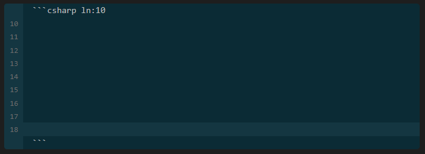

Simple Line number jump:

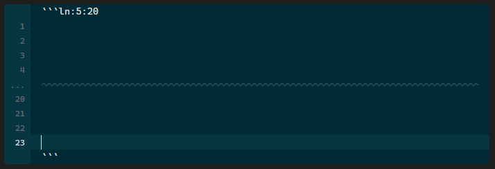  

## Syntax Themes

Syntax Themes let you change the colors used for syntax highlighting in code blocks. Pick a built-in theme or create your own. Each theme automatically adapts to Obsidian's dark and light mode.

Built-in themes: Obsidian, Dracula, Gruvbox, Nord, Solarized, Tokyo Night, VS Code Modern, Monokai, GitHub, Catppuccin.

An example JavaScript code block, with the default `PrismJS` syntax highlighting:  
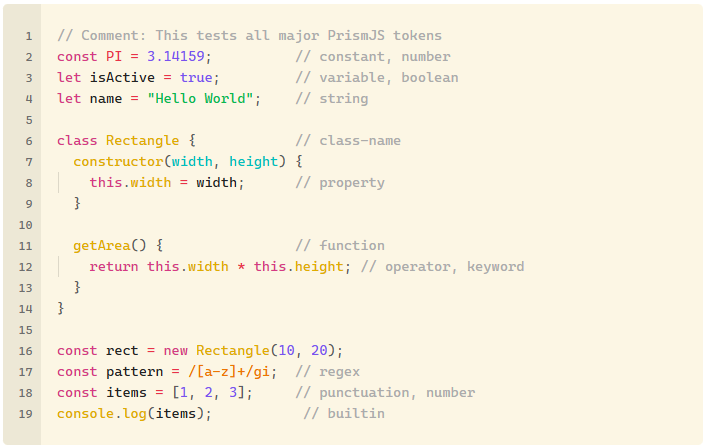

Same code block with `Nord` syntax theme applied:  
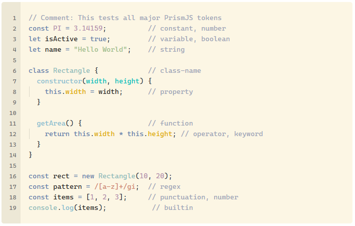

You can set a syntax theme globally for all languages, or override it for specific languages. For example, use Dracula globally but apply Nord to Python code blocks only.

> **Note:** 
> This feature works only with `PrismJS` tokens. For the best result, enable `Use PrismJS for syntax highlighting in editor mode`. Without it, syntax themes only apply in reading mode, **not** in editing mode.

### How it works

Syntax highlighting works by analyzing the text in a code block. Each word is identified as a `token`, which can be a keyword (`if`, `else`), a string, a number, a comment, etc. A color is then assigned based on the token type. The full list of tokens can be found [here](https://prismjs.com/tokens.html). Syntax Themes let you customize the color for each of these token types.  

## Highlighting

### Main Highlight

To highlight lines specify `hl:` followed by line numbers in the first line of the code block. 
- You can specify a single line numbers separated with a comma e.g.: `hl:1,3,5,7`. This would highlight the specified lines
- You can specify ranges e.g.: `hl:2-5` This would highlight lines from 2 to 5. 
- You can specify a string e.g.: `hl:test`. This would highlight all lines containing the word test. You can also prepend this value with a line number, or range and a `|` like this: `hl:5|test,5-7|test2`
- You can also combine the methods e.g.: `hl:1,3,4-6,test,5|test,7-9|test3` This would highlight lines 1, 3 and lines from 4 to 6.

Example:  
` ```cpp hl:1,3,4-6`


### Alternative Highlight

You can define multiple highlight colors. This means, that you have to define a name for the highlight color. This name will be used as a parameter, and you can use it just like with the `hl` parameter. 

Example: 
You define three types of highlight colors (`info`, `warn`, `error`). After that set the colors. After that you can use it in the first line of code blocks:
` ```cpp info:2 warn:4-6 error:8`

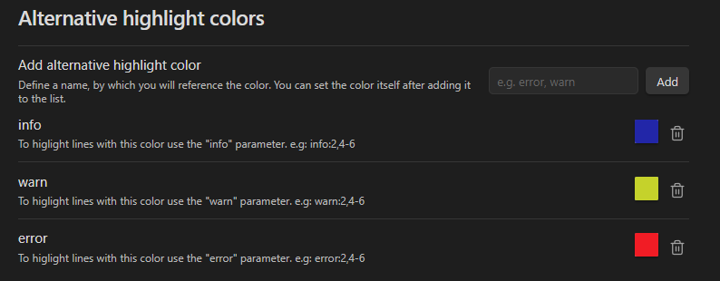

Example code block with multiple highlight colors:


### Text Highlight

It is possible now to highlight text instead of lines. To use this feature use the `hlt` parameter. 
* If after the `hlt:` parameter a string is defined, then the string is highlighted in every line it is present in the code block. Example: `hl:extension`
* If after the `hlt:` parameter a number is defined, then all words in the specified lines are highlighted . Example: `hl:5`
* If after the `hlt:` parameter a number is defined, followed by a pipe `|`, followed by a string, then the word is highlighted only in this line if it is present. Example: `hl:9|print`
* If after the `hlt:` parameter a range is defined, followed by a pipe `|` character, followed by a string, then the word is highlighted only in these line ranges, if it present. Example: `hl:6-7|print`
* If after the `hlt:` parameter a string, followed by a `:`, followed by a string is defined, then the string will be highlighted which starts with the string before the `:`, and ends with the string after `:` e.g.: `hlt:<startString>:<endString>`. Example: 
    * `hlt:abc:` -> startString is defined, but endString is not defined. This will highlight the text starting with `startString` until the end of the line
    * `hlt::xyz` -> startString is not defined, but endString is defined. This will highlight the text starting from the beginning of the line until `endString` 
    * `hlt:abc:xyz` -> highlights text starting with `abc` and ending with `xyz` in all lines it is present
* It is also possible to specify which occurences to highlight. This is done by using "[]" before the `|` character. You can specify indexes, or index ranges comma separated, and negativ indexes, which will highlight from the lines end. e.g. `hlt:5[1,3-5,-1]|test` will highlight the 1st,3rd,4th and the last occurence of test in line 5

All the above options can be prepended with an optional number or range and a `|` to specify in which line to highlight the text.

> [!note]
> - You can use the text highlighting with alternative highlight colors as well!
> - For every alternative highlight color a new text highlight parameter can be used. For example, if you created an alternative highlight color called `error`, then you can use the `error` parameter for line highlighting. To highlight text simply append a `t` after the alternative color name. This means that if you want to highlight text using the `error` color, you'll have to use the `errort` (note the `t` at the end) of the parameter.
> - If you want to highlight text which contains a `"` or `'` you'll have to escape it with a backslash. For example: `hlt:start\"text:end\"text` or `hlt:"start \" text:end \" text"`
> - If you want to highlight text which contains default line separator `|` or the default text separator `:`, you can redefine them, with the `lsep` and `tsep` parameters. For example: `hlt:5^|ˇ: lsep:^ tsep:ˇ` would highlight text from `|` to `:`. You can also globally define them

An example code block with text highlight, using three different colors is shown below:  

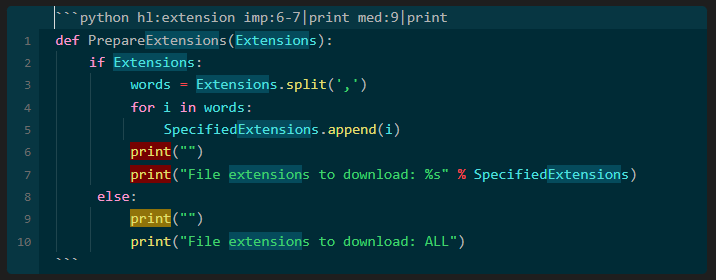

An example code block with text highlight, using from and to markers:  

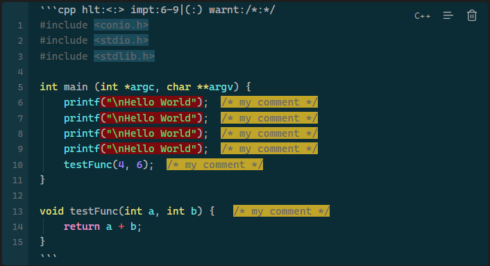

An example code block with text and occurence highlight is shown below:  

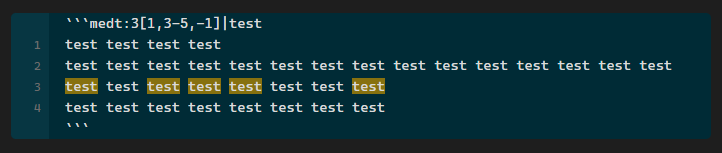  

## Language Specific Coloring

In the settings, on the `🎨 Appearance & Styling` settings page under `Language Specific Color Overrides` it is now possible to define colors for languages. These colors will only apply to code blocks with the defined language. If you defined colors for "Python", then those colors will only apply to every Python code block. **If you want to specify colors for code blocks which do not have a language defined, specify `nolang` as a language.**
First, you have to add a language. Then you can select which color you want to set. Available options are:
- Code block active line color
- Code block background color
- Code block border color
- Code block text color
- Matching bracket color
- Non-matching bracket color
- Matching bracket background color
- Non-matching bracket background color
- Selection match highlight color
- Header background color
- Header text color
- Header line color
- Header language text color
- Header language background color
- Gutter text color
- Gutter background color
- Gutter active line number color  

An example is shown below, where the background color has been defined for "Python", "JavaScript" and "C++" languages.

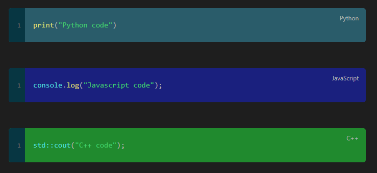

Example code blocks with border colors set:  

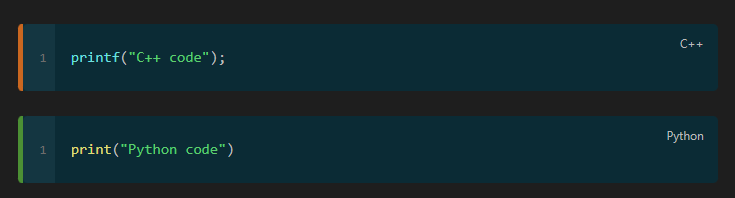  

**Don't forget to set `Codeblock border styling position`, otherwise border colors will not be displayed!**

## Folding

If the header is displayed, simply clicking on it, will fold the code block below it.
### Default Fold

To specify an initial fold state when the document is opened, specify `fold` in the first line of the code block. If `fold` is defined in a code block, then when you open the document, the code block will be automatically collapsed, and only the header will be displayed. You can unfold the code block by clicking on the header.

Example:  
` ```cpp fold`


### Semi-Fold

You can enable semi-folding in settings tab: 
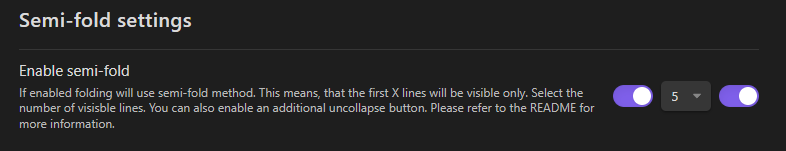

After enabling it, you have to select the count of the visible lines (default is 5). Optionally you can also enable an additional uncollapse button, which will be displayed in the last line.
Semi-fold works just like the normal fold with the following differences:
- If your code block doesn't have minimum required lines, then it will fold as until now.
- If your code block does have the minimum required line (count of visible lines + 4 for fading effect), then it will semi-fold.

The number of the "fade" lines is constant, and cannot be changed. 
Example: You set the count of visible lines to 5, and you have a code block with 10 lines. In this case semi-fold will be used. The first 5 lines remain visible, and the next 4 lines will "fade away". 

>[!note]
>In editing mode the opening and closing lines (with the three backticks) do not count!

Example semi-folded code block (light theme):  
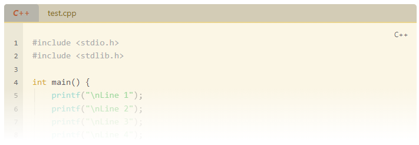

Example semi-folded code block (dark theme):  
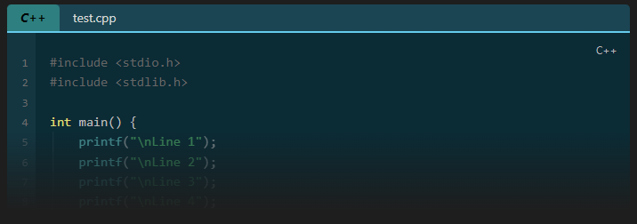

Example semi-folded code block with additional uncollapse button:  
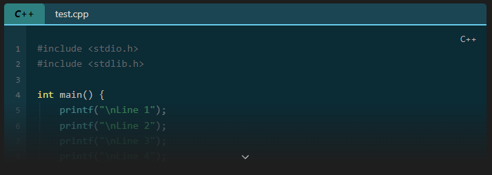


### Inverse Fold Behavior

When this options is enabled in the settings page, code blocks are collapsed by default when a document is opened, even if `fold` was **NOT** defined. If you enabled this option, and want some code blocks unfolded by default, you can use the `unfold` parameter.

## Wrap Code Lines

Wrapping code lines was already present in the plugin, but only in reading mode. Now, I also added this feature in editing mode. If you enabled the "Wrap code" button previously, you don't have to do anything else. If not, enable it in the settings page. A new button will be displayed, which when click will wrap/unwrap code lines.

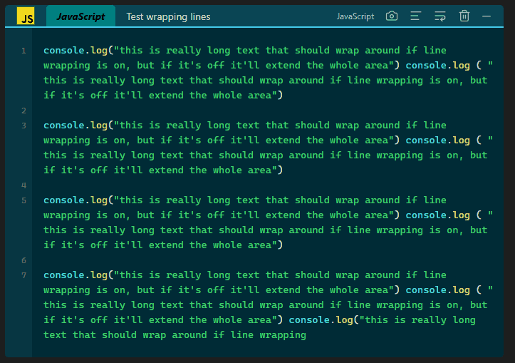

## Grouped Code Blocks 

You can combine multiple consecutive code blocks into a single, user-friendly tabbed interface. This is perfect for showing code in multiple languages or breaking up a long script into logical steps. 
Use the `group` parameter with the same name for each block. Use the optional `tab` parameter to set a custom name for each tab. 

**Example:**   

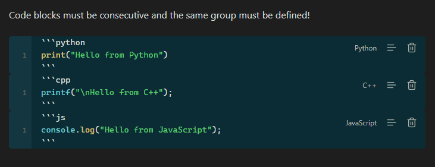

> [!important]
> Limitations
> - The name of the group must be unique per document!
> - Grouped code blocks are ungrouped when printing to PDF! This can't be changed unfortunately.

## Terminal Prompts

Create realistic and beautifully styled terminal prompts that can **simulate commands** like `cd` and `su`. To use a prompt, specify the language as `prompt:<name>`.
You can design your own prompts with custom templates, colors, and auto-use rules in the dedicated **Prompts** section of the plugin settings.

There are 3 type of prompts:
- predefined: provided by default from the plugin
- custom: created by you in the settings page
- on-the-fly: create by you simply in a code block

### Predefined Prompts

By default, the plugin comes with the following prompts:

| PromptID | Description |
| ---- | ----------- |
| bash | Bash prompt            |
| bashalt     | Alternative bash prompt             |
| cmd | Windows CMD Prompt |
| cstrike  | Cobalt Strike Prompt |
| docker | Docker prompt  |
| fish  | Fish Prompt  |
| kali  | Kali Linux Prompt  |
| msf | Metasploit prompt  |
| postgres  | Postgres Prompt  |
| ps | PowerShell prompt  |
| zsh | ZSH prompt |
| zshgit  | ZSH+Git prompt  |

You can use them simply defining `prompt:<promptID>` on the first line of code blocks e.g.: `prompt:kali`. You can change the default values globally in the settings page, or code block specific in using the  `user`, `host`, `path`, `db`, `branch` and `module` parameters.

### Custom Prompts

In the settings page you can simply create your own prompt. For example if you create a prompt with the name `myprompt`, you can use that simply by defining its name e.g.: `prompt:myprompt`.  
You can create a custom prompt by defining its structure, parsing logic, and styling rules using three key settings:
- `basePrompt`: This is the visual template for your prompt. Use placeholders (`{user}`, `{host}`, `{path}`, `{db}`, `{module}` and `{branch}`) to insert dynamic information.  
Example: `"{user}@{host}:{path}$"`
- `parsePromptRegex`: A Regular Expression used to identify and extract parts of a prompt string. It relies on named capture groups (e.g., `(?<user>...)`) to label the parts it finds.  
Example: `^(?<user>[^@]+)@(?<host>[^:]+)` captures the username and hostname.
- `highlightGroups`: A JSON object that maps the names from your regex capture groups (e.g., "user") to style classes. This tells the plugin which color to apply to each part of the prompt.  
Example: `{ "user": "user", "host": "host" }`

The `parsePromptRegex` finds the text for the user and host. The `highlightGroups` setting then links these parts to their respective styles, which are used to apply the correct colors.

### On-The-Fly Prompts

You can also create prompts dynamically in a code block e.g.: `prompt:test` would display `test` at the beginning of every line. You can also use placeholder for the above mentioned parameters, and then define them. In this case the values will be replaced e.g.: `prompt:"{user} at {host} in {path}" user:mugiwara host:PC1 path:/var/www/html`.

> [!important]
> Limitation
> The colors can **NOT** be set for On-Thy-Fly prompts!

### Supported commands

The following commands are supported:

| Command                 | Description                                                      |
| ----------------------- | ---------------------------------------------------------------- |
| `cd`                    | Go to home (`~`)                                                 |
| `cd ~`                  | Also goes to home                                                |
| `cd folder`             | Go into a folder                                                 |
| `cd ..`                 | Go one level up                                                  |
| `cd ../..`              | Go two levels up                                                 |
| `cd -`                  | Go back to previous dir                                          |
| `cd "some dir"`         | Quoted folder name                                               |
| `cd..`                  | Common typo for `cd ..`                                          |
| `cd ~/folder`           | Inside home dir                                                  |
| `cd /absolute`          | Full path                                                        |
| `pwd`                   | Shows current working directory                                  |
| `su`                    | Switch to root user                                              |
| `su <user>`             | Switch to specific user                                          |
| `whoami`                | Shows the current user                                           |
| `\c`                    | Change database in postgress                                     |
| `exit`                  | Switch back to the previous user after using `su` or `su <user>` |
| `git checkout <branch>` | Change branch                                                    |
| `git switch <branch>`   | Change branch                                                    |
| `use`                   | Change the Metasploit module                                     |

**Example:**  

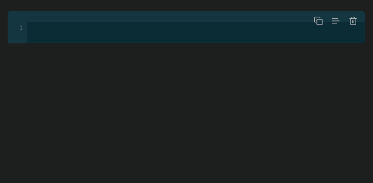

### Parsing raw CLI output

If the code block contains raw CLI output text including prompts, and you would just want to color the prompts automatically, you can use the `parse` parameter. You can specify the names of the default prompts, and the ones you created. For example `parse:bash` would look for bash prompts, that match the bash regex defined in the prompts settings page. If one is found, than the corresponding colors are automatically assigned.  

**Example:**  

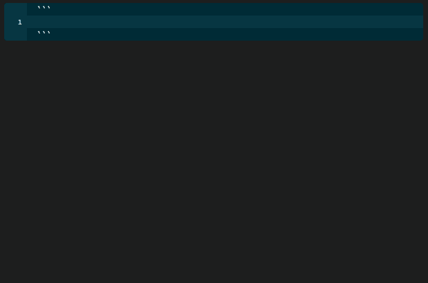  

## Annotations

Bring your code comments to life by turning them into styled annotations. This feature helps draw attention to important notes, warnings, or questions directly within your code.

Simply use the `[!type]` syntax within a standard line comment. Supported types include `note`, `warn`, `error`, `todo`, `question`, and `see`.
You can also define an optional title using the `[!<type>|<title>]` syntax.

**Example:**

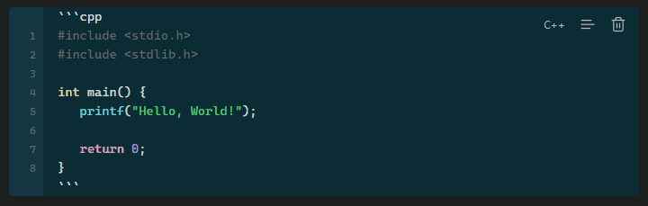

## Hide Fence Lines

You can enable the option `Hide Fence Lines` under the `👆 Behavior & Interaction` settings tab. After enabling the opening and closing fence lines will be hidden by default. They will only reappear when the cursor is moved into the code block.

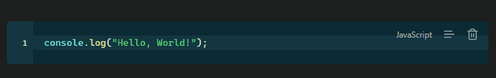

## Hiding Lines

Using the `hide` parameter it is possible to hide lines and/or ranges. The specified lines will be hidden and a separator will be inserted so you can unhide the lines. If a hidden line/range has been unhidden an additional button (eye) will be displayed, so you can re-hide the lines again. To hide lines simply specify the line numbers or ranges e.g. `hide:3,5,7-10`

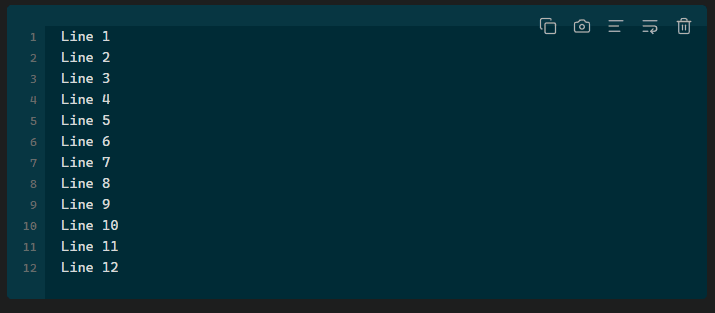

## Inline Code

If you want to style inline code, you have to enable it first. After that you can set the background color and the text color for inline code.

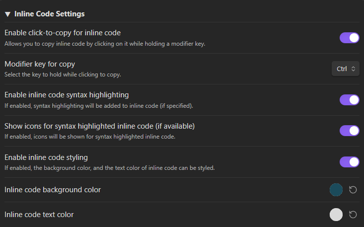

If you want to use syntax highlighted inline code then enable the appropriate option from the above settings. After enabling you can simply do ` {cpp} printf("\nHello World!") `. This will then be rendered as shown below:

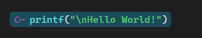

## Commands

There are five commands available in the command palette. You can:
- Fold all code blocks in the current document,
- Unfold all code blocks in the current document,
- Restore original state of code blocks
- Indent code block by one level
- Unindent code block by one level

If you collapsed/uncollapsed all code blocks there is no need to restore them to their original state. When you switch documents they are automatically restored to their original state.

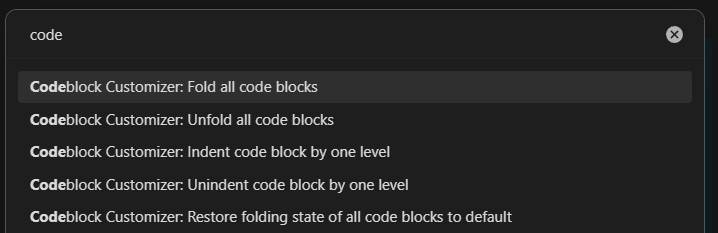

## Print to PDF

By default, the light colors are used for printing, but if you want to force the dark colors, you can enable the  toggle.

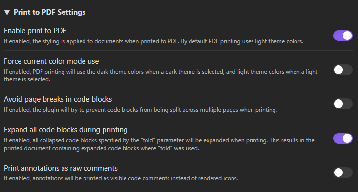

## Indented Code Blocks

Code blocks in **lists**, are now indented properly as shown below. Simply, mark the text in the code block, and press TAB. This will shift the code block right, by adding margin to the left side. Pressing TAB multiple times, indents the code block more. If you want to undo it, just select the text again, and press SHIFT+TAB.

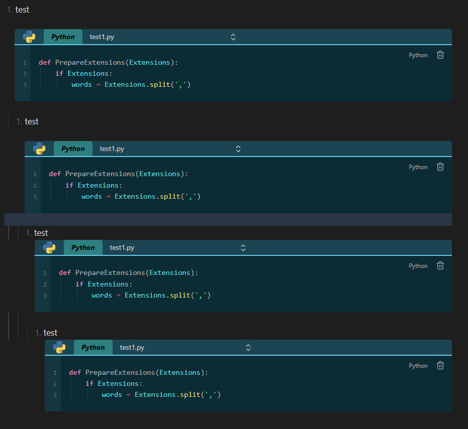

## Links

If you want to convert markdown, wiki and normal http/https link syntax to actual links inside code blocks, then you have to mark them as comment according to the current code block language, and enable the setting `Enable links usage` in the settings on the `👆 Behavior & Interaction` settings page. **Links can also be used in the header.**
For example if you are in a python code block, then you have write a "#" before the link (comment it out), and it will be automatically converted to a link. 
By default the links, which point to another document in your vault, are not updated, if you rename the file. This is because Obsidian does not provide (yet) a way to add these links to the metadata cache. A temporary solution for that is to enable the option `Enable automatically updating links on file rename` option in settings.

>[!important]
>Please note, that this method iterates over all of your documents in you vault! If you have a large vault, this process could take some time, although it is generally efficient.

Sample code block with links, but with the option `Enable links usage` disabled:

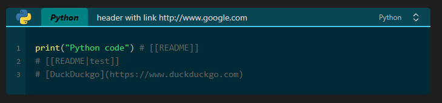

Same code block with the `Enable links usage` option enabled:

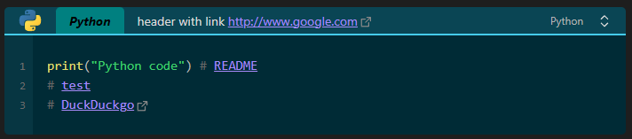

## Custom SVGs and Syntax Highlight Assignment

It is possible to use custom SVGs, and assign **existing** syntax highlighting for code blocks. To use this feature create the following folder `<VaultFolder>\.obsidian\plugins\codeblock-customizer\customSVG`. In this folder create a file called `svg.json` with similar content:

```json
{
  "languages": [
    {
      "codeblockLanguages": ["language1", "language2"],
      "displayName": "iRule",
      "svgFile": "f5.svg",
      "format": "tcl"
    }
  ]
}
```

Explanation:
- codeblockLanguages (**required**): one or more languages, where you want to apply the displayName, SVG, and format.
- displayName (**required**): the display Language, which is displayed in the header.
- svgFile (**optional**): name of an SVGfile in the same folder. **The file must be a plain text SVG without the SVG tag itself**. Look at [Const.ts](src/Const.ts) for examples.
- format (**optional**): the syntax highlighting to apply for this code block.

>[!important]
>Obsidian uses two different methods for syntax highlighting. For editing mode it uses CodeMirror 6, and for reading mode it uses Prism.js. Because of this there is a slight difference between how this works. 
>- If you want to apply syntax highlighting in editing mode, then the codeblockLanguage **must NOT** have syntax highlighting, because it is not possible (or I didn't found a way) to overwrite any existing syntax highlighting. For example `language1` does not have syntax highlighting, therefore the `tcl` syntax highlighting will be applied successfully. The languages specified in `codeblockLanguages` are **case sensitive** in editing mode
>- In reading mode however it is possible to overwrite existing syntax highlighting. So you can apply C++ syntax highlighting for a python code block. The languages specified in `codeblockLanguages` are **NOT case sensitive** in reading mode.

An example using the above shown JSON file, where `tcl` syntax highlighting is applied to `language1` code blocks, using the custom SVG file, and the custom display name:

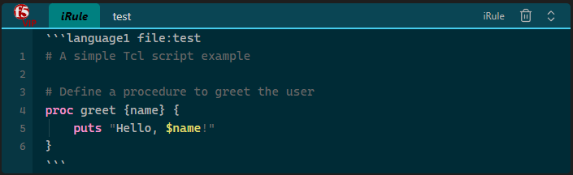

## Syntax Highlighting for Custom Languages

`PrismJS` provides syntax highlighting for a lot of languages, but there are still some, which it doesn't support. This feature lets you define your own syntax highlighting rules for those unsupported languages by creating a JSON configuration file. If `Use PrismJS for syntax highlighting in editor mode` is enabled (see [PrismJS Syntax Highlighting](#prismjs-syntax-highlighting)), the rules apply in both editor and reading mode. If it is not enabled, the rules will only apply in reading mode.

To get started, create a `customPrismLanguages.json` file in your `<VaultFolder>\.obsidian\plugins\codeblock-customizer\` folder. In this file you can define the RegExes used by `PrismJS` to provide syntax highlighting for those languages. You will need to define RegExes for the [tokens](https://prismjs.com/tokens.html). There are a few examples on the official `PrismJS` [website](https://prismjs.com/extending.html).

> [!important]
> The RegExes are stored as strings in the `customPrismLanguages.json` file. This means, that you will have to escape the backslashes. So instead of one backslash (`\`), you'll have to write two (`\\`).

> [!note]
> If the JSON file is malformed or contains invalid RegExes, a notice will be shown when the plugin loads.

A sample `customPrismLanguages.json` which provides syntax highlighting for the `ma3` language would look like this:

```json
{
  "ma3": {
    "comment": "/(^|[^\\\\#])#.*/gim",
    "string": [
      {
        "pattern": "/'(?:\\\\[\\s\\S]|[^\\\\''])*'/",
        "greedy": true
      },
      {
        "pattern": "/\"(?:\\\\[\\s\\S]|[^\\\\\"])*\"/",
        "greedy": true
      }
    ],
    "number": "/(?:\\b\\d+(?:\\.\\d*)?|\\B\\.\\d+)/gi",
    "operator": "/[-+*%]/",
    "slashModifier": {
      "pattern": "/(\\/\\w+)/",
      "alias": "class-name"
    },
    "macroInputPrompt": {
      "pattern": "/\\((?:\\\\[\\s\\S]|[^\\\\(\\\\)])*\\)/",
      "alias": "variable",
      "greedy": true
    },
    "macroVariableResolve": {
      "pattern": "/\\$.[^\\s]*/",
      "alias": "variable",
      "greedy": true
    },
    "keyword": "/\\b(?:\\w+)\\b/"
  }
}
```

`ma3` language without custom syntax highlight definition:  
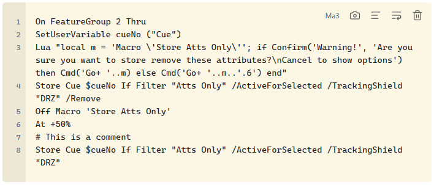

`ma3` language with custom syntax highlight definition:  
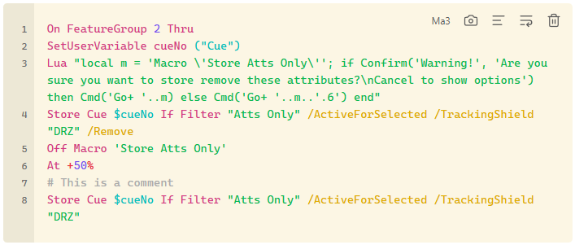


## Bracket Highlight

You can enable bracket highlighting for matching and also for non-matching brackets. If you click next to a bracket (`(,),{,},[,]`), then the bracket itself, and the corresponding opening/closing bracket will be highlighted. You can set individual background, and highlight colors for matching and non-matching brackets:

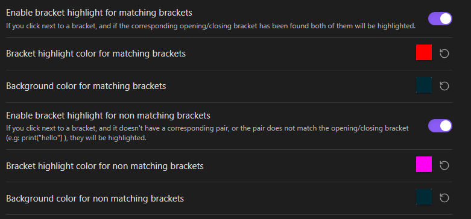

Below is a simple example. Notice that that the matching and non-matching bracket are highlighted with different colors:

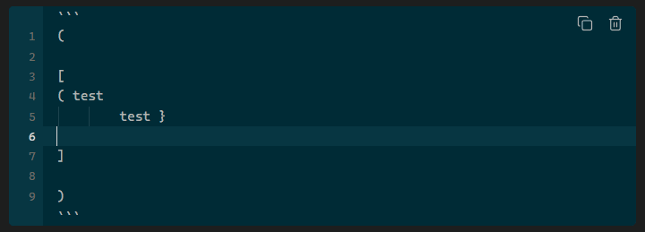

## Selection Matching

If you enable selection matching, you can set the background color for the matches to be highlighted with. Simply select a string, or double click on a word, and the same text will be highlighted if found:

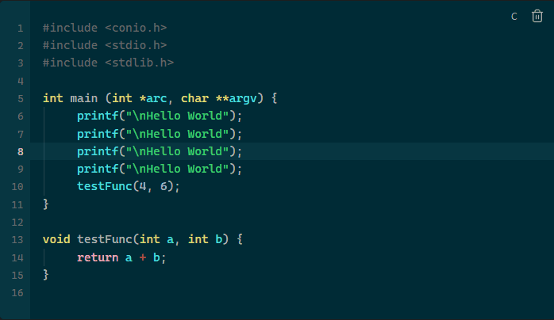

>[!note]
>Selection matching (currently) has a limit of 750 matches. If there are more matches than this, then selection matching will not highlight anything. Should you encounter a case where this number is not enough, contact me, and I'll increase it.

## Plugin Compatibility

The Plugin is compatible with Admonition and Execute Code plugins. In the settings page, there is a dedicated page for plugin compatibility settings.

### Admonition

The plugin also works with Admonitions in editing mode and reading mode as well.  

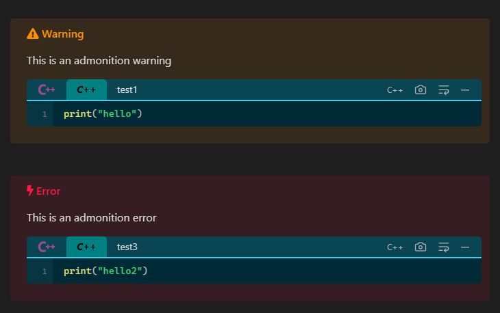

### Execute Code

For Execute Code you can choose if you want the "basic" styling (which is just the background color), or you want the more advanced styling (which includes lines numbers, highlighting lines and text in the output). 
To highlight lines and text in the Execute Code output you have to append an "o" to the highlight parameters. So `hl` works for normal code, but `hlo` works on execute code output. The same is with `hlt`. `hlt` work for normal code and `hlto` works for Execute code output. This logic also aplies to all of your custom highlight colors as well.  

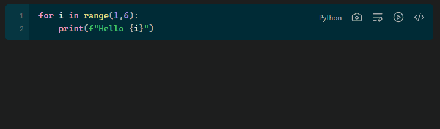

## How to Install the Plugin

- Simply install directly from Obsidian
- or you can just copy over `main.js`, `styles.css`, `manifest.json` to your vault `VaultFolder/.obsidian/plugins/codeblock-customizer/`.

## Contributing &Support

Found a bug or have a feature request? Please open an issue on the [GitHub repository](https://github.com/mugiwara85/CodeblockCustomizer).

If you like this plugin, and would like to help support continued development, use the button below!
 

<p align="center">
  <a href="https://www.buymeacoffee.com/ThePirateKing">
    
  </a>
</p>

